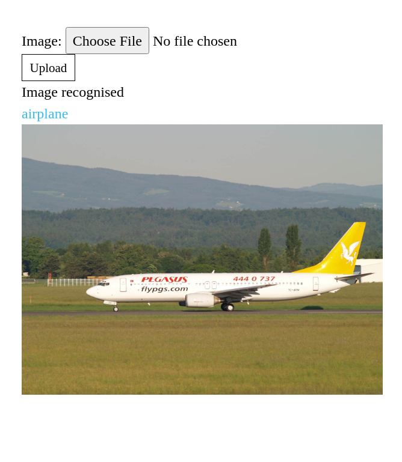
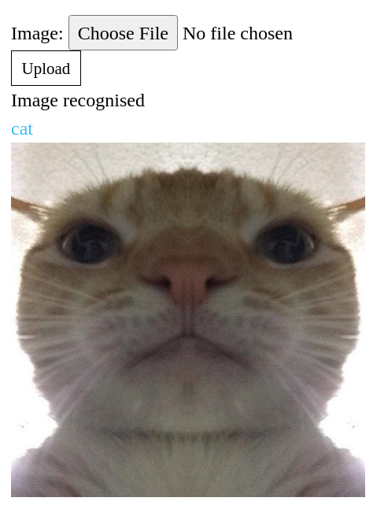

# My personal final project
For classification images using Django and Keras

# _Installation_
```bash
pip install requirements.txt
python manage.py makemigrations
python manage.py migrate
```
#  _Usage_
Running
```bash
python manage.py runserver
```
Then open http://127.0.0.1:8000/

# _Examples_
Here is my examples of running 







